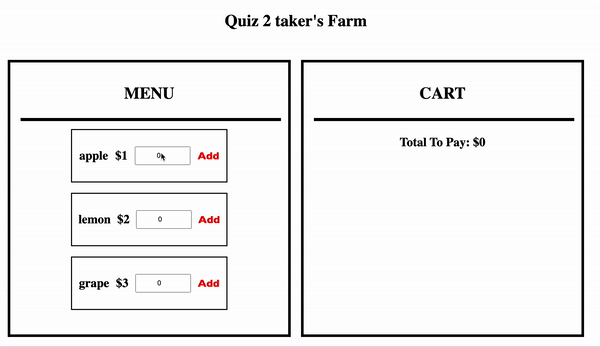

# Implementing An Ordering Page - Starter Code for Quiz 2
Congrats! Your family's farm business is currently going well and it is time for you to apply your web skills to help build a web page for this rapidly growing business!

 You are asked to create a simple ordering web page. As part of the development team, you only need to fulfill two simple functions of the page: <strong>adding items to cart</strong> and <strong>removing items from cart</strong>. Try your best to finish that!

## Attention
1. Starter codes are provided, you can add or delete any codes you want, as long as the final app is runnable
2. <strong>No need to do styling!!!</strong> CSS is already pre-created, just focus on the main logics
3. <strong>Please include your name in the file</strong> There is a line on the very top of the <strong>Components.jsx</strong> file, change the student_ name variable into your name. Then the page would show a line as <strong>"{Your Name}'s Farm"</strong>
```
    // Please put in your name here
    const student_name = "Quiz 2 taker";
```

## Functionalities

### Add items to cart
- Adding items to cart


- Increment number of item in cart

![Incrementing] (./pics/increment.gif "incrementing")
1. Before clicking the <strong>Add</strong> button: clients have to put in the amount of the item they want to purchase. Non-positive number or non-integer IS NOT ALLOWED. If an invalid number is input, no item should be created in the cart.
2. After clicking the <strong>Add</strong> button: if it is a new item, create a new cart item on the cart panel; if the item has already been created in the cart, just simply increment the data of that item (both total amount and total price), based on the input number.
3. After clicking the <strong>Add</strong> button: for the user-friendly purpose: the input field should be reset to 0
4. The total price of the cart should be incremented as items put into the cart.  

<strong> Total Price of Item = Item's Price * Item's Account </strong>

<strong> Total Price of Cart = Sum of All Items' Total Price </strong>

### Remove items from cart
1. After clicking the <strong>X</strong> button: the item will be immediately removed from the cart
2. After clicking the <strong>X</strong> button: the total price of cart will be decremented by the number of total price of removed item

## Components
The starter code is built on function component of React, if you want to use class component, you may have to do some modification

Hear are all the included components
- <strong>Page</strong>: main page wrapper
- <strong>Menu</strong>: menu panel
- <strong>Option</strong>: options of the menu
- <strong>Cart</strong>: cart panel
- <strong>CartItem</strong>: items in the cart

You are welcome to create more components, but with previous tests, these five components should be enough. 